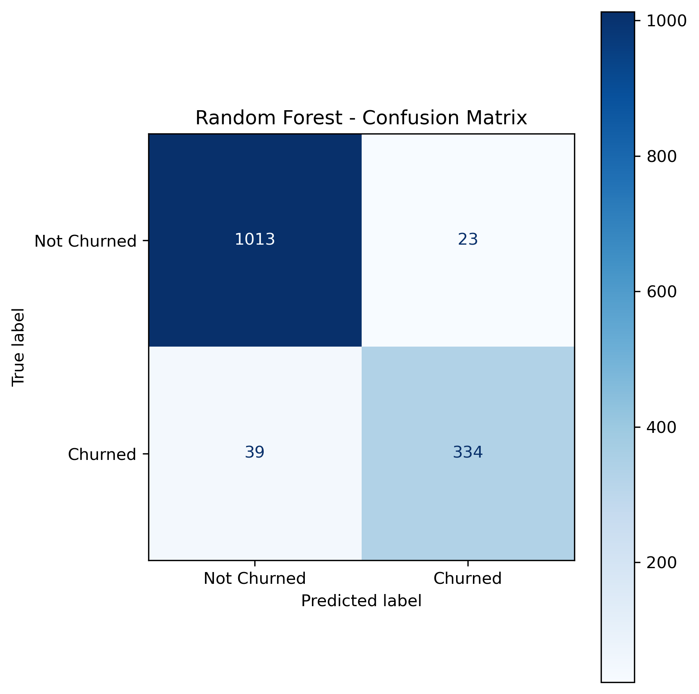
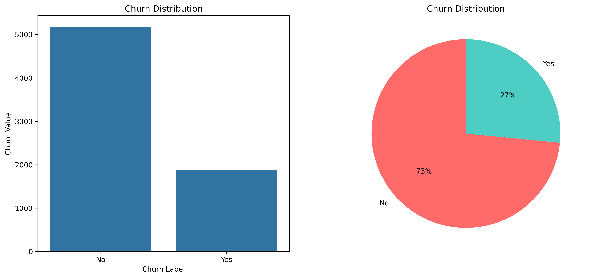
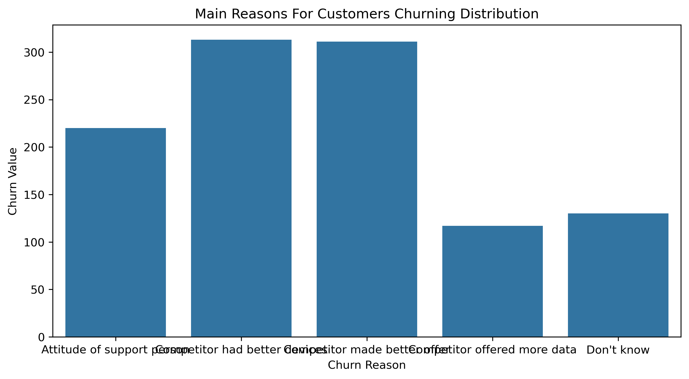
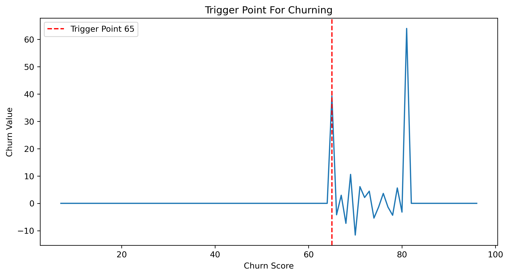
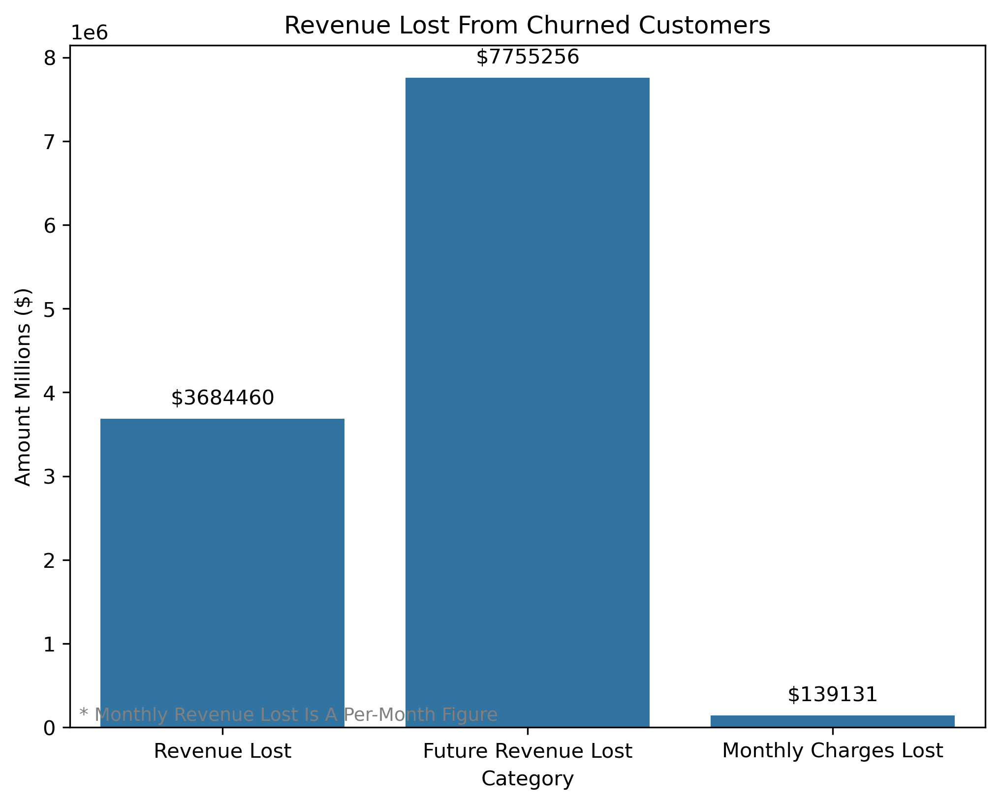
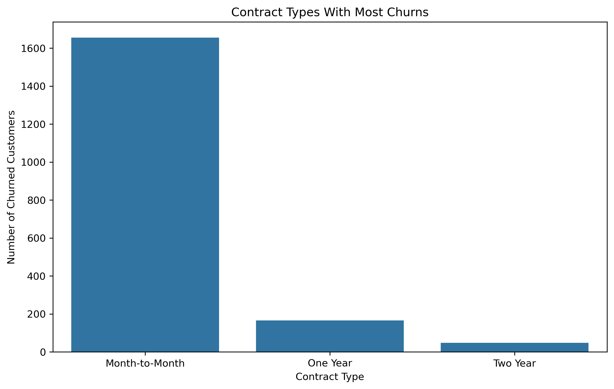
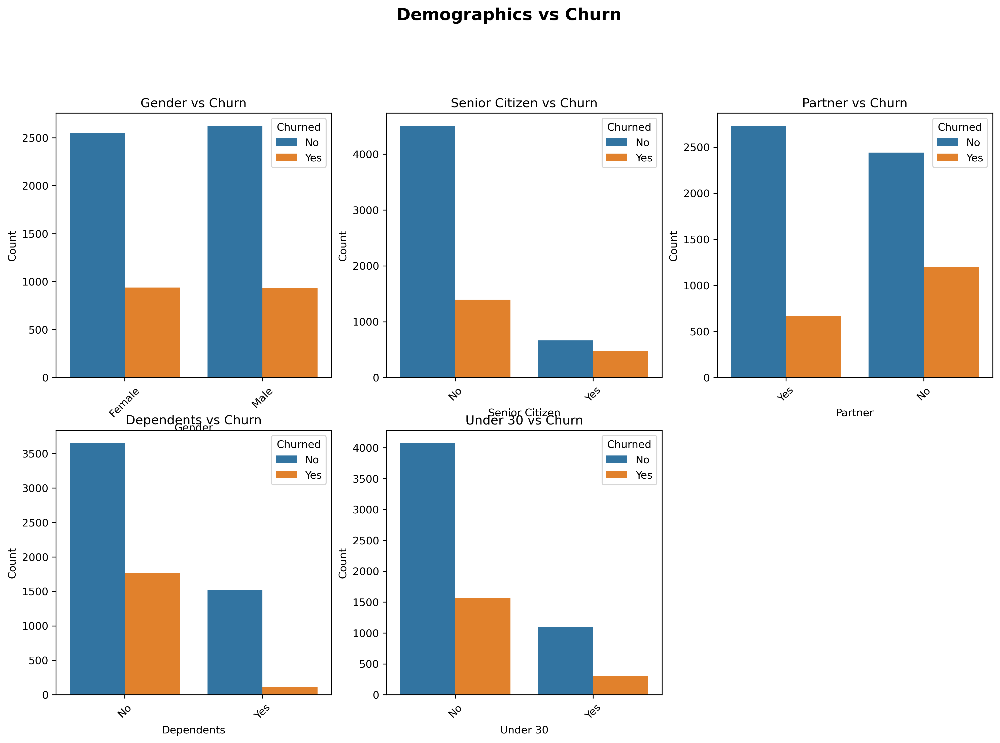

# 📉 Customer Churn Analysis & Prediction

A complete end-to-end machine learning project that analyzes customer churn behavior, identifies key risk factors, quantifies revenue loss, and builds a predictive model to flag at-risk customers before they leave.

---

## 📌 Project Overview

Customer churn is one of the most costly problems a business can face. This project uses a telecom customer dataset to:

- Explore and visualize churn patterns across demographics, services, contracts, and payment methods
- Quantify past and future revenue loss from churned customers
- Identify churn score danger zones and trigger points
- Train and tune a **Random Forest Classifier** to predict which customers are likely to churn
- Optimize the model for **recall** — prioritizing catching real churners over avoiding false alarms

---

## 📁 Dataset

The dataset is split across **6 CSV files** that are merged on `customer_id`:

| File | Description |
|---|---|
| `Customer_Info.csv` | Demographics — age, gender, dependents, partner |
| `Location_Data.csv` | Geographic data — city, state, zip code |
| `Online_Services.csv` | Service subscriptions — security, backup, streaming |
| `Payment_Info.csv` | Billing — charges, revenue, payment method |
| `Service_Options.csv` | Contract, phone, internet options |
| `Status_Analysis.csv` | Churn label, score, category, reason, CLTV |

**Dataset size:** 7,043 customers × 52 columns (pre-cleaning)

---

## 🗂️ Project Structure

```
churn-analysis/
│
├── notebook / churn-analysis.ipynb       # Main notebook
├── README.md                  # This file
└── datasets/
    ├── Customer_Info.csv
    ├── Location_Data.csv
    ├── Online_Services.csv
    ├── Payment_Info.csv
    ├── Service_Options.csv
    └── Status_Analysis.csv
└── images/
    ├── churn_distribution.png
    ├── churn_reasons.png
    ├── contract_type_churns.png
    ├── demograph_vs_churn.png
    ├── revenue_lost.png
    ├── trigger_point.png
    ├── feature_importance.png
    └── random_forest_actual_vs_predicted.png
```

---

## ⚙️ Requirements

```bash
pip install pandas numpy matplotlib seaborn scikit-learn
```

**Python version:** 3.8+

---

## 🔍 Exploratory Data Analysis

The EDA covers 8 key areas:

### 1. Churn Distribution
- ~26% of customers churned
- Visualized with a side-by-side bar chart and pie chart


### 2. Churn Reasons & Categories
- Filtered to reasons with 100+ occurrences
- Top categories: Competitor, Dissatisfaction, Attitude, Price


### 3. Churn Score Analysis
- Distribution of churn scores across all customers
- Line plot confirming higher scores correlate with higher churn rates
- Danger zone identification using percentage thresholds (40% and 70%)
- **Trigger point detection** — the exact churn score where the churn rate spikes sharply


### 4. Revenue Loss
| Metric | Value |
|---|---|
| Total revenue lost | $3,684,459 |
| Future revenue lost (CLTV) | $7,755,256 |
| Monthly recurring revenue lost | $139,130 |


### 5. Contract Type vs Churn
Month-to-month contracts have the highest churn concentration


### 6. Tenure vs Churn
Boxplot comparison shows churned customers have significantly lower median tenure

### 7. Satisfaction Score vs Churn
Churned customers consistently score lower on satisfaction

### 8. Demographics vs Churn
Grid of countplots across gender, senior citizen status, partner, dependents, and age group

---

## 🧹 Data Cleaning

**Columns dropped:**
- High null rate (>50%): `churn_reason`, `offer`
- Post-churn leakage columns: `churn_label`, `churn_score`, `churn_category`, `customer_status`
- Geographic irrelevance: `latitude`, `longitude`, `zip_code`, `country`, `state`, `city`
- Redundant columns: `under_30` (captured by `age`), `number_of_dependents`, `total_population`
- ID column: `customer_id`

**Null handling:**
- `internet_type`: 1,526 nulls filled with `'No Internet'` (customers with no internet service)

---

## 🔢 Encoding Strategy

| Type | Columns | Method |
|---|---|---|
| Binary (Yes/No) | `partner`, `dependents`, `online_security`, `online_backup`, `device_protection`, `premium_tech_support`, `streaming_tv`, `streaming_movies`, `streaming_music`, `paperless_billing`, `phone_service`, `multiple_lines`, `unlimited_data`, `internet_service`, `referred_a_friend` | Label Encoding (Yes=1, No=0) |
| Binary (Male/Female) | `gender` | Manual map (Male=1, Female=0) |
| Nominal | `internet_type`, `contract`, `payment_method` | One-Hot Encoding |

> No scaling applied — Random Forest is tree-based and scale-invariant.

---

## 🤖 Model Training

### Train/Test Split
- 80% training / 20% testing
- `random_state=42`

### Baseline Random Forest

```
Train Accuracy : 1.000
Test Accuracy  : 0.958
Gap            : 0.042
Precision      : 0.967
Recall         : 0.871
F1 Score       : 0.917
```

### Hyperparameter Tuning (RandomizedSearchCV)
- Scoring metric: `recall` (catching real churners is the business priority)
- CV folds: 5 | Iterations: 20

**Best parameters found:**
```python
{
  'n_estimators'    : 200,
  'max_depth'       : 15,
  'min_samples_split': 5,
  'min_samples_leaf' : 2
}
```

### Threshold Tuning
Default classification threshold (0.5) was lowered to **0.4** to improve recall:

| Metric | Baseline (0.5) | Tuned (0.4) | Change |
|---|---|---|---|
| Train Accuracy | 1.000 | 0.994 | ✅ Less overfit |
| Test Accuracy | 0.958 | 0.956 | ➡️ Same |
| Gap | 0.042 | 0.038 | ✅ Improved |
| Precision | 0.967 | 0.936 | ⬇️ Acceptable tradeoff |
| Recall | 0.871 | 0.895 | ✅ +0.024 |
| F1 Score | 0.917 | 0.915 | ➡️ Same |

---

## 📊 Confusion Matrix (Final Model)

```
                  Predicted Not Churned    Predicted Churned
Actual Not Churned        1024                   23
Actual Churned              39                  323
```

- **323** out of 373 actual churners correctly flagged ✅
- **39** churners missed ❌
- **23** false alarms raised on loyal customers ⚠️

---

## 💡 Key Findings

1. **Month-to-month contracts** are the highest churn risk — customers on longer contracts are significantly more loyal
2. **Low tenure customers churn most** — the first few months are the most critical retention window
3. **Churn trigger point** — churn rate spikes sharply at a specific churn score threshold, enabling proactive intervention
4. **Satisfaction score is a strong predictor** — churned customers consistently score 1–2 points lower
5. **Competitor-related reasons dominate churn** — pricing and product gaps are the primary push factors
6. **$7.7M in future CLTV at risk** — the financial impact of churn far exceeds the historical revenue figure

---

## 🚀 How to Run

1. Clone the repository
2. Place the 6 CSV files in a `data/` folder
3. Update the file paths in the notebook to point to your `data/` folder
4. Run all cells in order: `Kernel → Restart & Run All`

---

## 📈 Next Steps

- [ ] Build a simple scoring pipeline to run on new customer data

---

## 👤 Author

Built as part of a Data Science learning project covering EDA, feature engineering, and classification modeling with scikit-learn.
